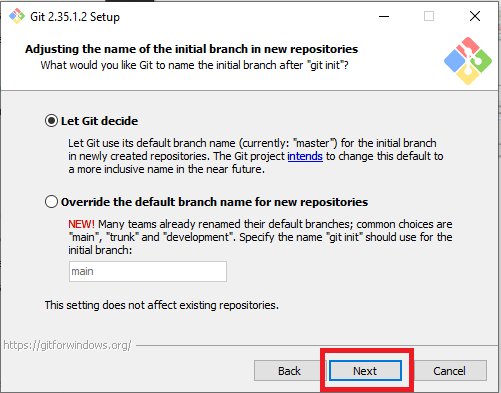

# Installing - Git in Windows
### Reading Time: 2 Minutes
### Tags: *git, windows*
- This is guide for installing Git for windows. Follow these steps to install Git in your Windows.

1. Check if `Git` is already installed in your system.
    1. Go to `Command Prompt` or `cmd` by typing `Command Prompt` in search menu. Click on `Command Prompt` as shown in the screenshot.
    
    

    2. A windows appears with Blinking Underscore, making ready to type in your command.
    
    

    3. Type:
    ```
    git --version
    ```
    4. If it returns the output like `git version 2.35.1.windows.2`. Git, is already installed in your system.
    
    

    5. If the output is like `'git' is not recognized as an internal or external command, operable program or batch file.`, Git is probably not installed in your system.
    
    

2. Go to the downloads page of git. [Click here](https://git-scm.com/download/win)

3. Click on `Click here to download` as shown below.


4. Choose the desired download location, and click `Save`. In my case, I am downloading in my Desktop.


5. Go the location where you have download the `.exe file`. Double Click on it.


6. Click `Yes` if prompted fer User Account Control.
7. A box for the installation appears. Click on `Next`.


8. Click on `Next`.


9. Click on `Next`.


10. Click on `Next`.


11. Click on the Drop Down Arrow and Select `Use the Nano editor by default`. and Click on `Next`.


12. Click on `Next`.


13. Click on `Next`.


14. Click on `Next`.


15. Click on `Next`.


16. Click on `Next`.


17. Click on `Next`.


18. Click on `Next`.


19. Click on `Next`.


20. Click on `Next`.


21. Click on `Install`. Wait for the installaion to complete.


22. Untick the `View Release Notes`. And click on `Finish`.
23. Congratulation `Git is installed`.